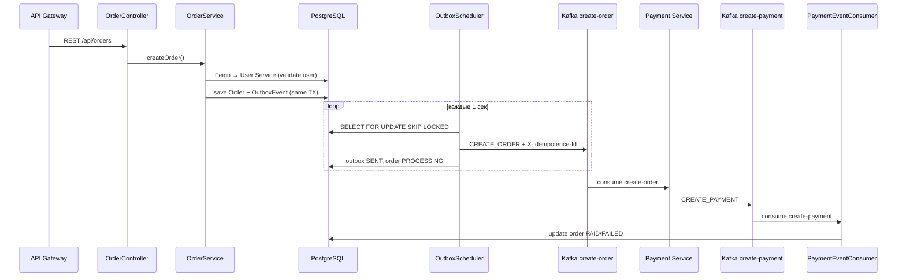
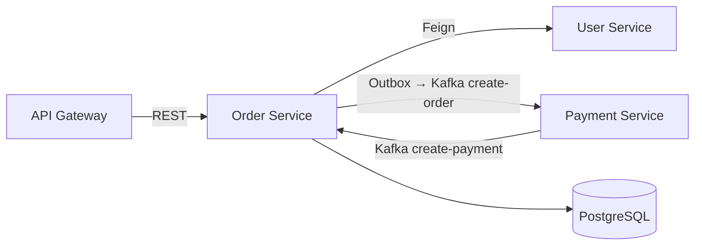

# Order Service

Микросервис управления заказами в распределённой системе. Сервис предоставляет REST API для CRUD-операций над заказами, позициями и каталогом товаров, интегрируется с User Service через Feign и надёжно публикует события создания заказа в Kafka через паттерн **Transactional Outbox**. Также потребляет события оплаты из Payment Service и обновляет статус заказа.

---

## Содержание

- [Назначение](#назначение)
- [Архитектура](#архитектура)
- [Паттерны](#паттерны)
- [Технологический стек](#технологический-стек)
- [Потоки данных](#потоки-данных)
- [REST API](#rest-api)
- [Kafka](#kafka)
- [Outbox](#outbox)
- [Хранилища данных](#хранилища-данных)
- [Партиционирование](#партиционирование)
- [Безопасность](#безопасность)
- [Профили и конфигурация](#профили-и-конфигурация)
- [Запуск](#запуск)
- [Тестирование](#тестирование)
- [Интеграция с другими сервисами](#интеграция-с-другими-сервисами)
- [Структура проекта](#структура-проекта)

---

## Назначение

Order Service выполняет следующие задачи:

1. **Управление заказами** — создание, чтение, обновление и удаление заказов через REST API.
2. **Управление позициями заказа и каталогом** — CRUD для `OrderItem` и `Item`.
3. **Интеграция с User Service** — получение данных пользователя по ID или email через Feign.
4. **Публикация событий** — надёжная отправка `OrderEventDto` в Kafka (топик `create-order`) через Transactional Outbox.
5. **Обработка результата оплаты** — подписка на топик `create-payment` и обновление статуса заказа (`PAID` / `FAILED`).
6. **Партиционирование таблицы orders** — автоматическое создание PostgreSQL-партиций по UUID v7 (ShedLock).

---

## Архитектура



---

## Паттерны

| Паттерн | Где используется | Описание |
|---------|------------------|----------|
| **Transactional Outbox** | `OutboxServiceImpl` + `OutboxScheduler` | Событие сохраняется в БД в одной транзакции с заказом, затем асинхронно публикуется в Kafka |
| **FOR UPDATE SKIP LOCKED** | `OutboxEventRepository` | Несколько инстансов могут параллельно обрабатывать outbox без блокировок |
| **Idempotent Producer** | Kafka producer config | `enable.idempotence=true`, `acks=all` |
| **Manual Ack Consumer** | `PaymentEventConsumer` | `manual_immediate` — ack после успешного обновления статуса |
| **Gateway Auth** | `GatewayAuthFilter` | JWT-аутентификация для запросов через API Gateway |
| **DTO Mapping** | MapStruct | `OrderMapper`, `ItemMapper`, `OrderItemMapper` |
| **Repository** | Spring Data JPA | Абстракция доступа к PostgreSQL |
| **Feign Client** | `UserClient` | HTTP-вызовы к User Service |
| **Distributed Lock** | ShedLock + `PartitionScheduler` | Исключение дублирования cron-задач партиционирования |

> **Inbox** на стороне consumer реализован в Payment Service. Order Service использует **Outbox** на стороне producer.

---

## Технологический стек

| Категория        | Технология |
|------------------|------------|
| Язык             | Java 21 |
| Framework        | Spring Boot 3.3.4 |
| Сообщения        | Apache Kafka (Spring Kafka) |
| SQL БД           | PostgreSQL 42.7 + Spring Data JPA |
| Миграции         | Liquibase |
| Маппинг          | MapStruct 1.6 |
| HTTP-клиент      | Spring Cloud OpenFeign |
| Безопасность     | Spring Security + Gateway JWT filter |
| Документация API | SpringDoc OpenAPI 3 |
| Метрики          | Micrometer + Actuator |
| Логирование      | Logback + Logstash JSON Encoder |
| UUID             | uuid-creator (time-ordered UUID v7) |
| Cron / Lock      | ShedLock 4.45 |
| Общие DTO        | `common-events` (GitHub Packages) |
| Контейнеризация  | Docker (multi-stage build) |
| Тесты            | JUnit 5, Mockito, Testcontainers, WireMock, spring-kafka-test |

---

## Потоки данных

### Исходящий поток (Order → Payment)

1. Клиент создаёт заказ через `POST /api/orders`.
2. `OrderServiceImpl` сохраняет заказ и outbox-событие в одной транзакции.
3. `OutboxScheduler` (каждую 1 сек) выбирает события (`INITIAL` / `FAILED`) с `FOR UPDATE SKIP LOCKED`.
4. `OutboxEventProducer` публикует `OrderEventDto` в топик `create-order` с заголовками:
   - `X-Idempotence-Id` — UUID outbox-события
   - `X-Event-Type` — например `ORDER_CREATED`
   - `X-Trace-Id` — trace ID из MDC
   - `X-Source-Service` — `orderservice`
5. После успешной отправки: outbox → `SENT`, order → `PROCESSING`.

### Входящий поток (Payment → Order)

1. Payment Service публикует `PaymentEventDto` в топик `create-payment`.
2. `PaymentEventConsumer` обновляет статус заказа на `PAID` или `FAILED`.
3. Manual ack после успешного сохранения; nack при ошибке.

### HTTP-поток

REST-запросы: `OrderController` / `OrderItemController` / `ItemController` → Service → Repository (+ Feign для пользователя).

---

## REST API

### Заказы — `/api/orders`

| Метод | Путь | Описание |
|-------|------|----------|
| `POST` | `/` | Создать заказ |
| `GET` | `/{id}` | Получить заказ по ID (с данными пользователя) |
| `PUT` | `/{id}` | Обновить заказ |
| `DELETE` | `/{id}` | Удалить заказ |
| `GET` | `/by-email?email=` | Заказы по email пользователя |
| `GET` | `/by-ids?ids=` | Заказы по списку UUID |
| `GET` | `/by-statuses?statuses=` | Заказы по статусам |
| `GET` | `/` | Все заказы |
| `GET` | `/paginated?page=&size=` | Пагинация (native query) |

### Позиции заказа — `/api/order-items`

| Метод | Путь | Описание |
|-------|------|----------|
| `POST` | `/` | Создать позицию |
| `GET` | `/{id}` | Получить по ID |
| `PUT` | `/{id}` | Обновить |
| `DELETE` | `/{id}` | Удалить |
| `GET` | `/by-ids?ids=` | По списку ID |
| `GET` | `/` | Все позиции |
| `GET` | `/paginated?page=&size=` | Пагинация |

### Товары — `/api/items`

| Метод | Путь | Описание |
|-------|------|----------|
| `POST` | `/` | Создать товар |
| `GET` | `/{id}` | Получить по ID |
| `PUT` | `/{id}` | Обновить |
| `DELETE` | `/{id}` | Удалить |
| `GET` | `/by-ids?ids=` | По списку ID |
| `GET` | `/` | Все товары |
| `GET` | `/paginated?page=&size=` | Пагинация |

Swagger UI: `http://localhost:8080/swagger-ui.html`

---

## Kafka

### Producer (Outbox)

| Параметр | Значение |
|----------|----------|
| Топик | `create-order` |
| Idempotence | `enable.idempotence=true` |
| Acks | `all` |
| Класс | `OutboxEventProducer` |

### Consumer

| Параметр | Значение |
|----------|----------|
| Топик | `create-payment` |
| Group ID | `order-service-group` |
| Ack mode | `manual_immediate` |
| Класс | `PaymentEventConsumer` |

---

## Outbox

### Таблица `outbox_table` (PostgreSQL)

| Колонка | Тип | Описание |
|---------|-----|----------|
| `id` | UUID (PK) | Идентификатор outbox-события |
| `aggregate_id` | varchar | ID заказа (Kafka key) |
| `event_type` | varchar | Тип события (`ORDER_CREATED`, …) |
| `payload` | jsonb | Сериализованный `OrderEventDto` |
| `source_service` | varchar | Имя сервиса-отправителя |
| `trace_id` | varchar | Trace ID |
| `status` | varchar | `INITIAL`, `PROCESSING`, `SENT`, `FAILED` |
| `created_at` | timestamp | Время создания |
| `updated_at` | timestamp | Время обновления |
| `processed_at` | timestamp | Время обработки |

### Жизненный цикл статусов

```
INITIAL → PROCESSING → SENT     (успех Kafka send)
INITIAL → PROCESSING → FAILED   (ошибка send / deserialize)
FAILED  → PROCESSING → SENT     (retry)
PROCESSING → FAILED             (recovery: updated_at старше outbox.processing-timeout-minutes)
```

Перед каждым циклом `OutboxScheduler` вызывает `resetStaleProcessingEvents`: «зависшие» события в статусе `PROCESSING` переводятся в `FAILED` и снова попадают в выборку вместе с `INITIAL`/`FAILED`. При ошибке публикации статус явно обновляется на `FAILED` (не остаётся в `PROCESSING`). То есть: если событие в PROCESSING и его updated_at старше now - 5 минут, оно становится FAILED и снова попадает в выборку (INITIAL / FAILED).

### Когда создаётся outbox-событие

Outbox-событие `ORDER_CREATED` создаётся **только при создании заказа** (`createOrder`). Обновление заказа (`updateOrder`) **не** порождает повторную публикацию в Kafka — это предотвращает дубли оплаты.

### Конфигурация outbox

| Свойство | По умолчанию | Описание |
|----------|--------------|----------|
| `outbox.processing-timeout-minutes` | `5` | Таймаут для recovery зависших `PROCESSING` |
| `outbox.batch-size` | `100` | Размер batch при выборке событий |

---

## Хранилища данных

### PostgreSQL

| Таблица | Назначение |
|---------|------------|
| `orders` | Заказы (range-partitioned by UUID v7) |
| `order_items` | Позиции заказа |
| `items` | Каталог товаров |
| `outbox_table` | Transactional Outbox |
| `shedlock` | Блокировки для cron |

Миграции: `src/main/resources/db/changelog/`.

**Схема БД:** `spring.jpa.hibernate.ddl-auto=validate` — Hibernate только проверяет соответствие entity и Liquibase-миграций, не изменяет схему автоматически (исключает расхождение `ddl-auto=update` + Liquibase).

---

## Партиционирование

- Таблица `orders` — **range-partitioned** по time-ordered UUID v7.
- `PartitionScheduler` (cron + ShedLock) создаёт партицию на следующий день.
- `orders_default` — DEFAULT-партиция для заказов без явной партиции.

---

## Безопасность

- **Spring Security** — все `/api/**` требуют аутентификации.
- **GatewayAuthFilter** — парсит JWT из заголовка `Authorization` (запросы от Gateway с `X-Internal-Call` + `X-Source-Service`).
- **OrderAuthorizationService** — проверка владельца заказа:
  - обычный пользователь видит и изменяет **только свои** заказы;
  - списки (`/`, `/by-statuses`, `/paginated`, …) фильтруются по `userId` из JWT (`sub`);
  - пользователь с `ROLE_ADMIN` имеет доступ ко всем заказам;
  - попытка доступа к чужому заказу → `403 Forbidden`.
- **Публичные эндпоинты** — `/actuator/**`, Swagger (dev).
- **Feign** — прокидывает `X-Trace-Id` и `X-Internal-Call` в User Service.

### Бизнес-правила createOrder

1. Проверка прав (`verifyCanCreateOrderForUser`).
2. Валидация пользователя через Feign **до** сохранения заказа (исключает «осиротевшие» заказы при недоступном User Service).
3. Сохранение заказа + outbox в одной транзакции.

---

## Профили и конфигурация

| Профиль | Файл | Назначение |
|---------|------|------------|
| *(default)* | `application.properties` | Общие настройки (Kafka, Actuator, Liquibase, `ddl-auto=validate`, outbox) |
| `dev` | `application-dev.properties` | Локальная разработка (localhost DB/Kafka, Swagger, verbose logs) |
| `prod` | `application-prod.properties` | Production (env vars для DB, Docker hostnames) |
| `test` | `application-test.properties` (test scope) | Unit/smoke тесты без БД/Kafka |
| `testcontainer` | `application-testcontainer.properties` (test scope) | Integration тесты с Testcontainers |

---

## Запуск

### Требования

- Java 21
- Maven 3.9+
- Docker (для Kafka, PostgreSQL)
- GitHub Packages token (для `common-events`, `common-filters-starter`)

### Локально (dev)

```bash
# Kafka
docker-compose -f docker-compose-kafka-only.yml up -d

# PostgreSQL — локально или через docker-compose

# Сборка и запуск
mvn spring-boot:run -Dspring-boot.run.profiles=dev
```

### Docker

```bash
docker build \
  --build-arg GITHUB_TOKEN=<token> \
  --build-arg GITHUB_USERNAME=<username> \
  -t orderservice .

docker run -p 8082:8082 \
  -e DB_HOST=postgres -e DB_PORT=5432 \
  -e DB_ORDER_NAME=orderdb -e DB_USER=postgres -e DB_PASSWORD=<password> \
  orderservice
```

Профиль `prod` активируется автоматически в Dockerfile.

---

## Тестирование

```bash
mvn test
mvn verify   # + JaCoCo report: target/site/jacoco/index.html
```

Покрытие JaCoCo (instruction coverage) — ~85%+ по основному коду; unit-тесты покрывают сервисы, outbox, security, фильтры, advice, конфигурации и schedulers.

### Структура тестов

```
src/test/java/com/mymicroservice/orderservice/
├── configuration/          # AbstractContainerTest (PostgreSQL Testcontainers)
├── integration/
│   ├── controller/         # @WebMvcTest
│   ├── repository/         # @DataJpaTest + Testcontainers
│   ├── service/            # WireMock + Feign
│   └── kafka/              # @EmbeddedKafka + Testcontainers
├── unit/
│   ├── service/            # Mockito
│   ├── kafka/              # Mockito (consumer/producer)
│   ├── scheduler/          # Mockito
│   ├── security/           # OrderAuthorizationService, 401/403 handlers
│   ├── filter/             # GatewayAuthFilter
│   ├── advice/             # GlobalAdvice
│   ├── config/             # FeignConfig, OpenApiConfig
│   ├── util/               # ErrorItem, MdcUtils
│   └── mapper/             # MapStruct, JsonMapper
└── util/
    ├── data/               # TestConstants
    └── *Generator.java     # Генераторы тестовых объектов
```

### Типы тестов

| Класс | Тип | Инфраструктура |
|-------|-----|----------------|
| `OrderServiceImplTest` | Unit | Mockito |
| `OutboxServiceImplTest` | Unit | Mockito (recovery, FAILED on error) |
| `OrderAuthorizationServiceTest` | Unit | SecurityContext |
| `GatewayAuthFilterTest` | Unit | JWT parsing |
| `GlobalAdviceTest` | Unit | Exception handlers |
| `FeignConfigTest` / `OpenApiConfigTest` | Unit | Config beans |
| `OutboxEventRepositoryTest` | Data | resetStaleProcessingEvents |
| `PaymentEventConsumerTest` | Unit | Mockito |
| `OutboxEventProducerTest` | Unit | Mockito + Awaitility |
| `StateServiceImplTest` | Unit | Mockito |
| `*ControllerTest` | Web (@WebMvcTest) | MockMvc |
| `*RepositoryTest` | Data (@DataJpaTest) | Testcontainers PostgreSQL |
| `OutboxEventRepositoryTest` | Data | Testcontainers PostgreSQL |
| `OrderServiceWireMockIT` | Integration | WireMock + Feign |
| `OutboxFlowIT` | Integration | @EmbeddedKafka + Testcontainers PG |
| `PaymentEventConsumerIT` | Integration | @EmbeddedKafka + Testcontainers PG |
| `OrderserviceApplicationTests` | Smoke | Mock beans, profile `test` |

### Генераторы тестовых данных

| Класс | Назначение |
|-------|------------|
| `OrderGenerator` | `Order` entity |
| `OrderDtoGenerator` | `OrderDto` |
| `ItemGenerator` | `Item` |
| `OrderItemGenerator` | `OrderItem` |
| `UserGenerator` | `UserDto` (Feign response) |
| `OrderEventDtoGenerator` | `OrderEventDto` |
| `PaymentEventDtoGenerator` | `PaymentEventDto` |
| `OutboxEventGenerator` | `OutboxEvent` |
| `TestConstants` | Общие константы для тестов |

### Стиль именования тестов

```
<имяМетода>_Should<Ожидание>_When<Условие>
```

Пример: `saveOutboxEvent_ShouldPersistEvent_WhenSerializationSucceeds`

---

## Интеграция с другими сервисами



| Сервис | Направление | Протокол | Контракт |
|--------|-------------|----------|----------|
| API Gateway | → Order Service | REST `/api/**` | JWT via Gateway |
| Order Service | → User Service | HTTP Feign | `UserDto` |
| Order Service | → Payment Service | Kafka `create-order` | `OrderEventDto` + idempotence headers |
| Payment Service | → Order Service | Kafka `create-payment` | `PaymentEventDto` + trace headers |

---

## Структура проекта

```
orderservice/
├── src/main/java/.../orderservice/
│   ├── advice/           # GlobalAdvice
│   ├── client/           # UserClient (Feign)
│   ├── config/           # Security, Kafka, Feign, OpenAPI, ShedLock
│   ├── controller/       # REST controllers
│   ├── dto/              # DTO
│   ├── exception/        # Custom exceptions
│   ├── filter/           # GatewayAuthFilter
│   ├── kafka/            # PaymentEventConsumer, OutboxEventProducer
│   ├── mapper/           # MapStruct + JsonMapper
│   ├── model/            # JPA entities + enums
│   ├── repository/       # Spring Data JPA
│   ├── scheduler/        # OutboxScheduler, PartitionScheduler
│   ├── security/         # OrderAuthorizationService, 401/403 handlers
│   └── service/          # Business logic
├── src/main/resources/
│   ├── application.properties
│   ├── application-dev.properties
│   ├── application-prod.properties
│   └── db/changelog/
└── src/test/java/.../orderservice/
    ├── configuration/
    ├── integration/
    ├── unit/
    └── util/
```

---

## Лицензия

Учебный / демонстрационный проект @juliakaiko.
